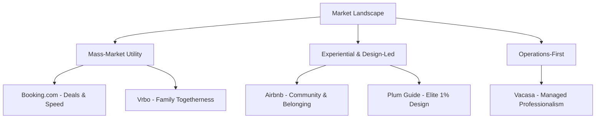
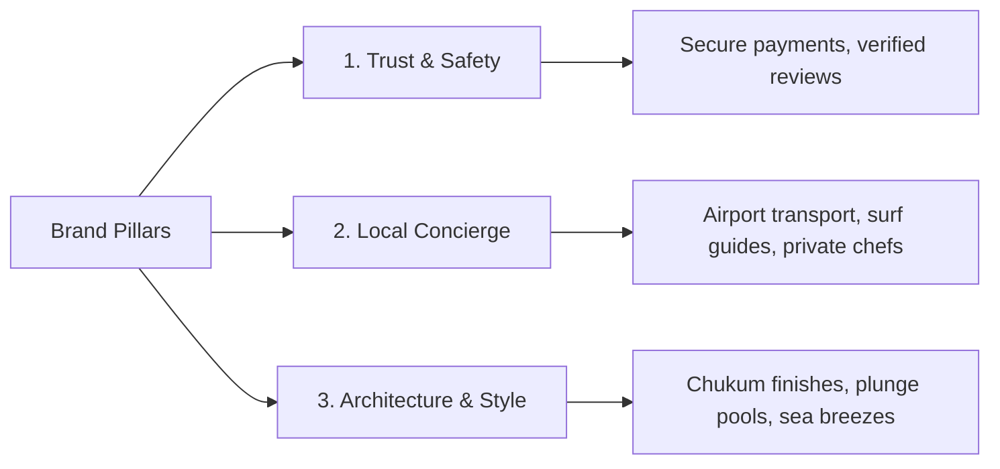

# Competitive Research & Branding Analysis: Vacation Rental Platforms

This competitive research report analyzes the top five vacation rental booking platforms used globally and in Mexico’s coastal destinations (like Tulum, Sayulita, Puerto Escondido, and Cabo). It breaks down their positioning, visual aesthetics, brand systems, and call-to-action (CTA) strategies to provide actionable inspiration for constructing your own brand.

---

## 1. Executive Summary & Market Positioning

When booking vacation rentals in Mexico—especially in small beach towns—travelers face a trade-off between **unique design/adventure** and **security/operational reliability**. 

The top five platforms span a wide spectrum from raw transactional utility to highly curated editorial design. Understanding where they sit helps you identify the "white space" for your own brand.



---

## 2. In-Depth Platform Breakdowns

### 1. Airbnb: The Experiential Pioneer

Airbnb positions itself not as a booking engine, but as a community platform built on **belonging and unique experiences**.

```
  ██████   [#FF385C - Rausch]
  ██████   [#FC642D - Babu]
  ██████   [#00A699 - Kazan]
  ██████   [#222222 - Dark Charcoal]
```

*   **Positioning:** *"Belong anywhere."* Focuses on the emotional benefits of travel, connection to local neighborhoods, and finding unique architectural stays.
*   **Vibes & Feel:** Warm, human, design-forward, lifestyle-focused, friendly, and aspirational.
*   **Logo (The Bélo):** A continuous loop combining a person (head), a location pin (place), a heart (love), and the letter 'A'. It is designed to be easily drawn and universal, representing a stamp of hospitality.
*   **Color Palette:**
    *   **Primary (Rausch):** `#FF385C` — a vibrant coral-red that is warm, energetic, and distinct from corporate travel blues.
    *   **Accents:** `Babu` (`#FC642D` - orange/coral) and `Kazan` (`#00A699` - soft teal).
    *   **Neutrals:** Clean white backgrounds with `#222222` for dark text (avoiding harsh pure black) and `#717171` for secondary text.
*   **Typography:** **Airbnb Cereal** (a bespoke geometric sans-serif). It balances clean functionality with friendly, rounded geometry, maintaining high legibility from small buttons to massive billboards.
*   **CTA Strategy:**
    *   **Primary Hero:** A flexible, floating search widget that uses the CTA *"I’m flexible"* to encourage discovery and impulse browsing.
    *   **Interactive Booking:** Sticky, floating footer bar on mobile with a clean, high-contrast, rounded booking button that displays price and rating prominently.
*   **Mexico & Beach Town Execution:** Uses categories like "Beachfront", "Tropical", and "Surfing" at the top of the homepage to filter destinations. Photography features warm, golden-hour natural lighting, highlighting organic textures (palapa roofs, hammocks, ocean vistas).

---

### 2. Vrbo: The Family & Group Travel Classic

Vrbo (Vacation Rentals By Owner) focuses entirely on **whole-home rentals for groups and families**, emphasizing space, privacy, and security.

```
  ██████   [#0E214B - Indigo]
  ██████   [#245ABC - Cobalt Blue]
  ██████   [#328EEE - Sky Blue]
  ██████   [#E86024 - Coral Accent]
```

*   **Positioning:** *"Together is a better place."* Target audience is families and multi-generational groups. The core promise is whole-home privacy (no shared spaces with hosts) and reliable vacation environments.
*   **Vibes & Feel:** Trustworthy, classic, comforting, nostalgic, and security-oriented.
*   **Logo:** A fluid, intertwined striped mark that spells "Vrbo". The colored bands represent diverse paths, journeys, and coming together.
*   **Color Palette:**
    *   **Primary Indigo:** `#0E214B` — a deep, stabilizing navy representing security and trust.
    *   **Secondary Blues:** `#245ABC` (Cobalt) and `#328EEE` (Sky) representing blue waters, skies, and outdoor leisure.
    *   **Accent (Coral/Orange):** `#E86024` — used selectively for alerts, badges, or high-urgency callouts.
*   **Typography:** Pairings of **Dala** (an angular, whimsical serif for headings that evokes vacation ease) and **Freight Sans Pro** (a highly legible, friendly humanist sans-serif for UI/copy).
*   **CTA Strategy:**
    *   **Primary Search:** Large, block-style search widget with a direct, high-contrast blue search button.
    *   **Urgency CTAs:** Soft blue banners and notifications highlighting features like "Book with Confidence guarantee" to reassure groups spending large amounts on a rental.
*   **Mexico & Beach Town Execution:** Hero imagery frequently features massive beachfront homes in Cabo or Riviera Maya with spacious pool decks, outdoor grills, and large dining tables—directly appealing to family reunions or group trips.

---

### 3. Booking.com: The High-Volume Conversion Machine

Booking.com is a pure utility brand focused on **deals, speed, and massive inventory comparison**.

```
  ██████   [#003580 - Resolution Blue]
  ██████   [#009FE3 - Cerulean]
  ██████   [#FEBA02 - Selective Yellow]
```

*   **Positioning:** *"Search, book, and go."* Positions itself as the ultimate helper for the practical traveler. Differentiates on ease, instant booking confirmation, and the widest possible accommodation mix (hotels, cabins, apartments).
*   **Vibes & Feel:** Transactional, intense, crowded, efficient, and conversion-optimized (high cognitive load, heavy use of social proof).
*   **Logo:** A simple, corporate, lowercase sans-serif wordmark that includes the ".com" to ground it in digital utility.
*   **Color Palette:**
    *   **Primary Blue (Resolution):** `#003580` — deep corporate blue that builds trust, safety, and operational size.
    *   **Accent Blue (Cerulean):** `#009FE3` — lighter blue used to soften the UI.
    *   **Action Yellow:** `#FEBA02` — a high-contrast yellow used exclusively for search blocks, CTAs, and highlight badges to immediately pull the user's eye.
*   **Typography:** System-based sans-serif typefaces (like **Segoe UI** or Arial) designed to render instantly on any browser and maximize data density.
*   **CTA Strategy:**
    *   **Primary CTA:** Bright blue buttons over yellow backgrounds.
    *   **Microcopy:** Heavy use of behavioral nudges like *"Only 1 room left at this price!"*, *"Free cancellation"*, and *"Genius discount applied"*.
*   **Mexico & Beach Town Execution:** Displays standard grid layouts focusing heavily on value and proximity to local attractions. Stays are ranked by distance to beaches or downtown centers with badge highlights like "Excellent beach location - 9.4".

---

### 4. Vacasa: The Professional Property Manager

Vacasa differentiates by owning the **entire physical operations loop**, managing properties locally for homeowners and ensuring hotel-grade consistency.

```
  ██████   [#083B32 - Forest Green]
  ██████   [#0A8A75 - Teal]
  ██████   [#FDFBF7 - Warm Cream]
```

*   **Positioning:** *"Vacation rentals made easy."* It speaks directly to both guests (guaranteeing professional cleaning, local guest services, 24/7 care) and homeowners (revenue management, marketing).
*   **Vibes & Feel:** Clean, professional, structured, refreshing, and highly reliable.
*   **Logo:** Three overlapping rings. The outer ring is the Vacasa brand, the middle ring represents homeowners, and the inner ring represents guests—showing a balanced ecosystem.
*   **Color Palette:**
    *   **Primary Dark Green:** `#083B32` — a rich, natural forest green that evokes landscapes, luxury, and calm.
    *   **Teal Accent:** `#0A8A75` — used for primary CTAs and interactive UI components.
    *   **Backgrounds:** Off-white/warm creams (`#FDFBF7`) instead of sterile clinical whites to feel more like a home.
*   **Typography:** **Nunito Sans** — a modern, friendly Google Font with rounded stroke terminals that feel clean yet approachable.
*   **CTA Strategy:**
    *   **Primary Homepage CTA:** Clean, teal search button.
    *   **Secondary Trust CTA:** Prominent "Vacasa Premium Clean" badges and "Local Management" promises on listing pages.
*   **Mexico & Beach Town Execution:** Highlights local team support, showcasing photos of on-site staff and localized concierge amenities (e.g., airport shuttle coordination, pre-arrival grocery stocking).

---

### 5. Plum Guide: The Design-Obsessed Authority

Plum Guide positions itself as the **"Michelin Guide" for vacation rentals**, accepting only the top 1% of homes in any city based on design and quality audits.

```
  ██████   [#FDBB2F - Sunglow Yellow]
  ██████   [#000000 - Stark Black]
  ██████   [#F8F7F4 - Alabaster Cream]
```

*   **Positioning:** *"The world's best holiday homes."* The brand targets affluent, design-conscious travelers who are willing to pay a premium to avoid "booking lottery" disappointments.
*   **Vibes & Feel:** Editorial, sophisticated, curated, elite, confident, and highly visual (resembling a luxury lifestyle magazine).
*   **Logo:** A bold, architectural, geometric sans-serif wordmark.
*   **Color Palette:**
    *   **Primary Accent (Sunglow):** `#FDBB2F` — a rich, warm yellow-orange that feels optimistic, premium, and memorable.
    *   **Structural Neutrals:** High contrast combinations of rich **Stark Black** (`#000000`) and soft **Alabaster Cream** (`#F8F7F4`) to allow listing photography to pop.
*   **Typography:** 
    *   **Headers:** **Domaine Display Narrow** (a high-contrast serif font that immediately signals high-end print editorial design).
    *   **Body & UI:** **Halyard Display** (a modern, structured sans-serif for clean readability).
*   **CTA Strategy:**
    *   **Style:** Minimalist, black outline buttons or solid black buttons with clean, lowercase or uppercase spaced lettering.
    *   **Language:** Direct, authoritative microcopy like *"Book now"* or *"View 1% homes"*.
*   **Mexico & Beach Town Execution:** Curation is editorial. Listings feature architectural details (e.g., "brutalist concrete structures matching the Tulum jungle canopy", "private ocean-view plunge pools"). Photography is shot by professional architectural photographers, using sharp shadows and artistic compositions.

---

## 3. Brand Comparison Matrix

| Dimension | Airbnb | Vrbo | Booking.com | Vacasa | Plum Guide |
| :--- | :--- | :--- | :--- | :--- | :--- |
| **Core Target** | Stays & unique experiences | Families & large groups | Budget/value travelers | Property owners & guests | Affluent, design lovers |
| **Brand Vibe** | Warm, community, organic | Trustworthy, together | High-volume, transactional | Professional, consistent | Editorial, luxury, elite |
| **Primary Color** | Coral-red (`#FF385C`) | Navy indigo (`#0E214B`) | Royal blue (`#003580`) | Forest green (`#083B32`) | Sunglow yellow (`#FDBB2F`) |
| **Accent Color** | Kazan Teal (`#00A699`) | Sky Blue (`#328EEE`) | Selective Yellow (`#FEBA02`) | Soft Teal (`#0A8A75`) | Stark Black (`#000000`) |
| **Header Font** | Airbnb Cereal (Sans) | Dala (Serif) | System Sans (Segoe UI) | Nunito Sans (Sans) | Domaine Display (Serif) |
| **Core Value** | "Belong anywhere" | "Together is better" | Value, speed, choice | "Vacation rentals made easy" | "The top 1% vetted homes" |
| **Main CTA** | "Search" / "I'm flexible" | "Search" | "Search" / "See deals" | "Search" / "Book Now" | "View homes" / "Book now" |

---

## 4. Brand-Building Playbook: Creating Your Beach Town Vacation Rental Brand

If you are constructing a brand specifically for a vacation rental business in a Mexican beach town, here is a strategic blueprint you can follow.

### 1. Visual Aesthetics & Themes
Avoid generic "beach house blue" palettes. Leverage Mexico's rich landscape, architecture, and artisanal textures:

```
  ██████   Terracotta / Clay [#D36B50]  --> Warmth, earth, artisanal tile
  ██████   Agave / Olive Green [#5F7464] --> Jungle foliage, nature, agave fields
  ██████   Sand / Warm Linen [#EFEBE4]  --> Beaches, natural stone walls
  ██████   Deep Ocean Teal [#0F4E5A]    --> The Pacific/Caribbean sea depths
```

*   **Vibe:** **"Tropical Modernism"** or **"Eco-Luxe Sanctuary"**. It should feel rustic yet premium, combining raw materials (concrete, parota wood, chukum plaster) with high-end comfort.
*   **Logo Style:** Minimalist line art. Incorporate symbols like palm leaves, sea waves, palapa roofs, or local wildlife (turtles, pelicans) rendered in abstract, clean shapes.
*   **Typography Pairing:**
    *   **Headers:** Use a sophisticated serif (e.g., *Playfair Display* or *Lora*) to establish an editorial, relaxed luxury feel.
    *   **Body & Forms:** Use a clean, friendly geometric sans-serif (e.g., *Inter* or *Outfit*) to ensure booking details are easy to read and forms are simple to fill out.

### 2. Website Layout & CTA Strategy
*   **Hero Section:** Place a stunning, full-screen video background of the waves crashing, the pool deck, or the sunset, with a simple, integrated booking bar.
*   **The "Five-Second Rule":** Immediately convey three things above the fold:
    1.  What the property is (e.g., "A private 3-villa eco-resort").
    2.  Where it is (e.g., "Sayulita, Mexico").
    3.  A direct path to see rates (a clear "Check Availability" button).
*   **Sticky CTAs:** On mobile, implement a sticky bottom footer bar with a single, clear button: **[ Book Now ]** or **[ Rates & Availability ]**. This keeps the booking path one tap away as they browse photos.

### 3. Positioning and Content Pillars
To succeed in Mexican beach towns, your messaging should hit these key pillars:



1.  **Trust & Safety (Reducing Friction):** Address traveler anxieties about booking internationally. Highlight secure payment methods, detailed travel directions, reliable high-speed Wi-Fi (critical for digital nomads), and water purification systems.
2.  **Local Concierge (Adding Value):** Don't just sell the bed; sell the destination. Highlight custom add-ons like airport shuttles, surfboard rentals, private massage therapists, and private chef dinners with local, fresh-caught seafood.
3.  **Architecture & Style (The Hook):** Focus copywriting and imagery on architectural textures (e.g., *"brushed concrete walls"*, *"locally sourced parota wood furniture"*, *"open-concept ocean-breeze living"*). Use descriptive verbs that invite the reader to picture themselves in the space (e.g., *"Sip your morning espresso overlooking the jungle canopy..."*).
